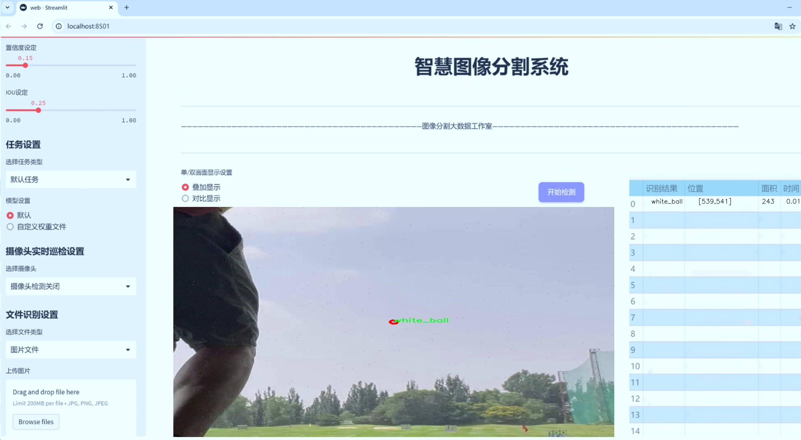
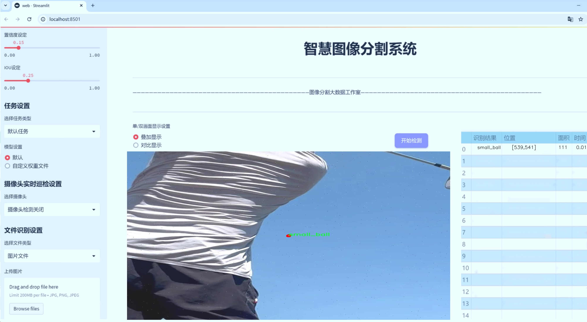
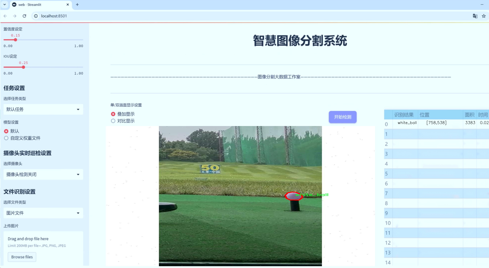
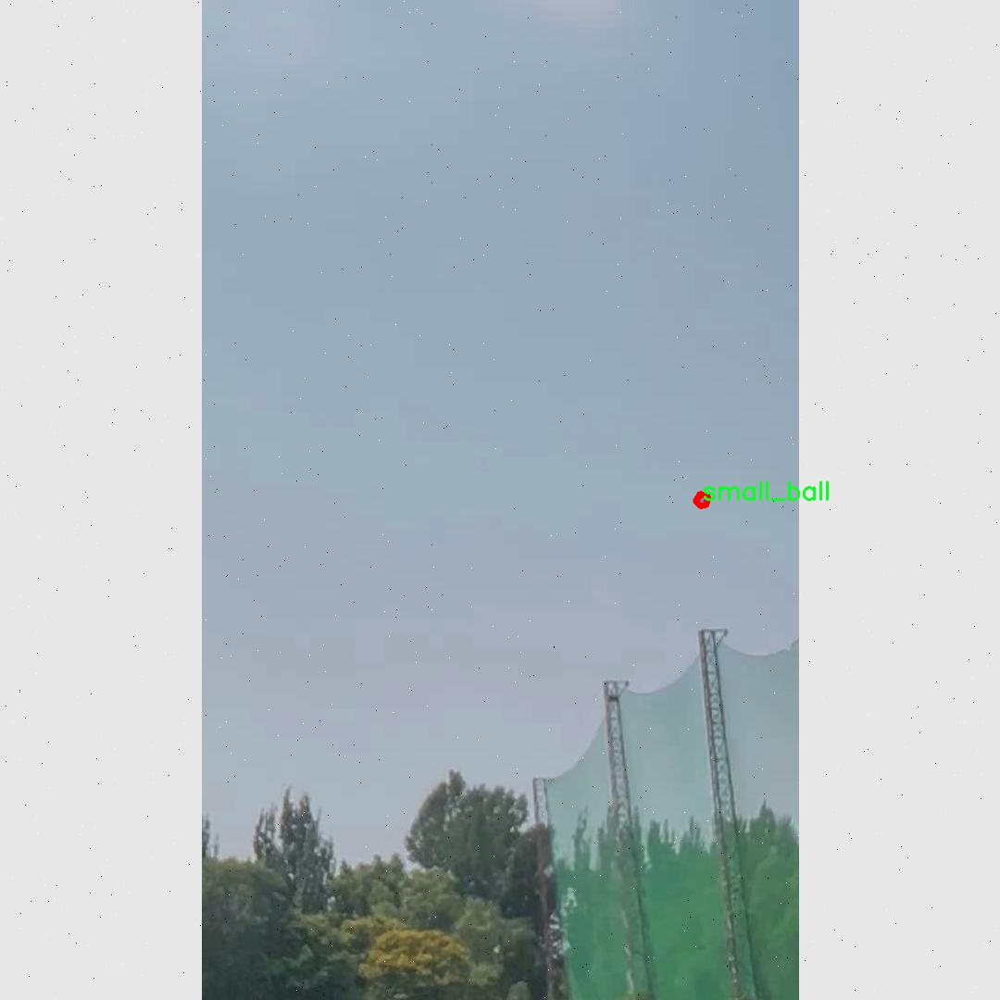
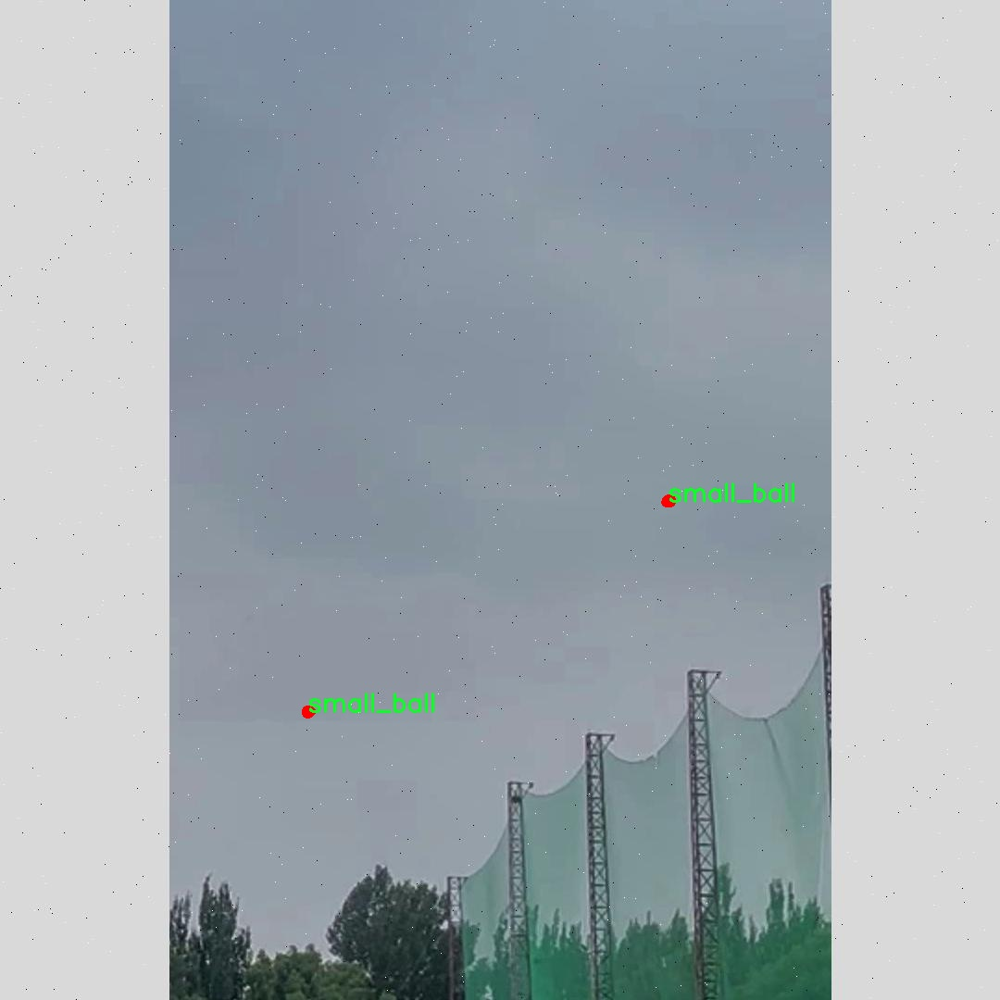
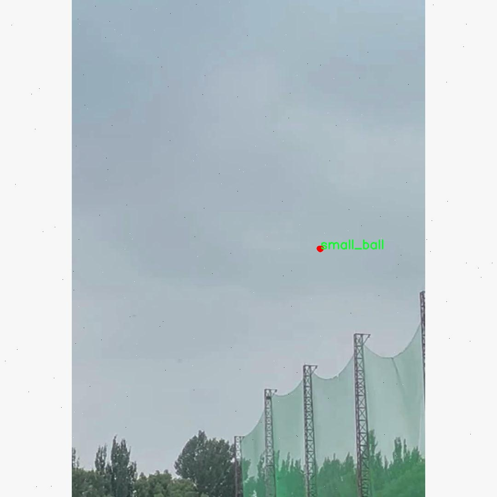

# 高尔夫球分割系统： yolov8-seg-LAWDS

### 1.研究背景与意义

[参考博客](https://gitee.com/YOLOv8_YOLOv11_Segmentation_Studio/projects)

[博客来源](https://kdocs.cn/l/cszuIiCKVNis)

研究背景与意义

随着计算机视觉技术的迅猛发展，深度学习在图像处理领域的应用越来越广泛，尤其是在物体检测与分割方面。高尔夫作为一项受欢迎的运动，其相关技术的研究逐渐受到重视。高尔夫球场的复杂环境以及多样化的球具使得高尔夫球的检测与分割任务具有一定的挑战性。传统的图像处理方法在处理高尔夫球的分割时，往往难以满足实时性和准确性的要求。因此，基于深度学习的实例分割技术，尤其是YOLO（You Only Look Once）系列模型的应用，成为了研究的热点。

YOLOv8作为YOLO系列的最新版本，具有更高的检测精度和更快的推理速度，适合在复杂场景中进行实时物体检测与分割。针对高尔夫球的实例分割任务，改进YOLOv8模型不仅能够提高分割精度，还能有效处理高尔夫球场中不同类别物体的干扰，如高尔夫球杆、不同颜色的高尔夫球等。数据集“golf-instance-seg-3”包含1700张图像，涵盖了5个类别，包括“club_head”、“small_ball”、“white_ball”和“yellow_ball”。这些数据为模型的训练和验证提供了丰富的样本，使得模型能够学习到高尔夫球及其相关物体的特征。

在高尔夫球的实例分割研究中，准确识别和分割不同类型的高尔夫球及其球具，对于提升高尔夫运动的智能化水平具有重要意义。通过对高尔夫球的精确定位和分割，可以为高尔夫运动的自动化分析提供基础数据，进而推动智能高尔夫训练系统的研发。这不仅有助于提高运动员的训练效率，还能为高尔夫爱好者提供更为精准的运动数据分析。

此外，基于改进YOLOv8的高尔夫球分割系统的研究，具有重要的社会和经济意义。随着高尔夫运动的普及，相关的智能化设备和服务需求日益增长。通过实现高尔夫球的自动识别与分割，可以为高尔夫球场的管理、赛事的组织、以及运动员的训练提供有效的技术支持。这将促进高尔夫产业的数字化转型，推动相关产业链的发展，带来显著的经济效益。

综上所述，基于改进YOLOv8的高尔夫球分割系统的研究，不仅在技术上具有重要的创新意义，还在应用层面展现出广阔的前景。通过对高尔夫球及其相关物体的精确分割，可以为高尔夫运动的智能化、自动化发展提供有力支撑，推动整个行业的进步与发展。因此，深入研究和探索这一领域，将为未来的高尔夫技术创新奠定坚实的基础。

### 2.图片演示







注意：本项目提供完整的训练源码数据集和训练教程,由于此博客编辑较早,暂不提供权重文件（best.pt）,需要按照6.训练教程进行训练后实现上图效果。

### 3.视频演示

[3.1 视频演示](https://www.bilibili.com/video/BV1QHBQYPEWr/)

### 4.数据集信息

##### 4.1 数据集类别数＆类别名

nc: 4
names: ['club_head', 'small_ball', 'white_ball', 'yellow_ball']


##### 4.2 数据集信息简介

数据集信息展示

在高尔夫球分割系统的研究与开发中，数据集的选择与构建至关重要。本项目所使用的数据集名为“golf-instance-seg-3”，专门为改进YOLOv8-seg模型而设计，旨在提升高尔夫球及其相关物体的实例分割精度。该数据集包含四个主要类别，分别是“club_head”（球杆头）、“small_ball”（小球）、“white_ball”（白球）和“yellow_ball”（黄球）。这些类别的选择不仅反映了高尔夫运动的基本构成要素，也为模型的训练提供了丰富的多样性。

首先，数据集中的“club_head”类别代表了高尔夫球杆的头部部分，这是进行击球的关键部位。准确识别和分割球杆头对于理解击球动作及其与球的相互作用至关重要。在训练过程中，模型需要学习如何在不同的环境和光照条件下识别球杆头的形状和特征，这对于提高模型的鲁棒性和准确性具有重要意义。

其次，“small_ball”类别则主要指代在高尔夫球场上使用的小型训练球。这些小球通常用于练习和训练，其颜色和材质可能与正式比赛用球有所不同。因此，模型需要具备识别不同类型小球的能力，以适应多样化的训练场景。通过对这一类别的学习，模型能够更好地处理在实际应用中可能遇到的各种小球。

“white_ball”类别则专注于传统的高尔夫球，这种球通常为白色，是高尔夫比赛中最常见的球种。数据集中包含的各种白球图像，涵盖了不同的拍摄角度、光照条件和背景环境，使得模型在训练时能够获得更全面的特征信息，从而提升其在真实场景中的表现。

最后，“yellow_ball”类别则涉及到黄色高尔夫球，这种球在某些特定的天气条件下（如阴天或光线较暗时）更易于被识别。通过对黄色球的实例分割，模型不仅能够提高对不同颜色球的识别能力，还能增强其在复杂环境下的适应性。

总的来说，“golf-instance-seg-3”数据集通过精心设计的类别划分，为改进YOLOv8-seg模型提供了丰富的训练素材。每个类别的选择都经过深思熟虑，旨在确保模型能够在实际应用中表现出色。数据集的多样性和复杂性为模型的训练提供了良好的基础，使其能够在高尔夫球的实例分割任务中实现更高的准确率和鲁棒性。通过对这些类别的深入学习，研究人员希望能够推动高尔夫球分割技术的发展，为未来的智能体育应用奠定坚实的基础。








### 5.项目依赖环境部署教程（零基础手把手教学）

[5.1 环境部署教程链接（零基础手把手教学）](https://www.bilibili.com/video/BV1jG4Ve4E9t/?vd_source=bc9aec86d164b67a7004b996143742dc)


[5.2 安装Python虚拟环境创建和依赖库安装视频教程链接（零基础手把手教学）](https://www.bilibili.com/video/BV1nA4VeYEze/?vd_source=bc9aec86d164b67a7004b996143742dc)

### 6.手把手YOLOV8-seg训练视频教程（零基础手把手教学）

[6.1 手把手YOLOV8-seg训练视频教程（零基础小白有手就能学会）](https://www.bilibili.com/video/BV1cA4VeYETe/?vd_source=bc9aec86d164b67a7004b996143742dc)


按照上面的训练视频教程链接加载项目提供的数据集，运行train.py即可开始训练



     Epoch   gpu_mem       box       obj       cls    labels  img_size
     1/200     0G   0.01576   0.01955  0.007536        22      1280: 100%|██████████| 849/849 [14:42<00:00,  1.04s/it]
               Class     Images     Labels          P          R     mAP@.5 mAP@.5:.95: 100%|██████████| 213/213 [01:14<00:00,  2.87it/s]
                 all       3395      17314      0.994      0.957      0.0957      0.0843

     Epoch   gpu_mem       box       obj       cls    labels  img_size
     2/200     0G   0.01578   0.01923  0.007006        22      1280: 100%|██████████| 849/849 [14:44<00:00,  1.04s/it]
               Class     Images     Labels          P          R     mAP@.5 mAP@.5:.95: 100%|██████████| 213/213 [01:12<00:00,  2.95it/s]
                 all       3395      17314      0.996      0.956      0.0957      0.0845

     Epoch   gpu_mem       box       obj       cls    labels  img_size
     3/200     0G   0.01561    0.0191  0.006895        27      1280: 100%|██████████| 849/849 [10:56<00:00,  1.29it/s]
               Class     Images     Labels          P          R     mAP@.5 mAP@.5:.95: 100%|███████   | 187/213 [00:52<00:00,  4.04it/s]
                 all       3395      17314      0.996      0.957      0.0957      0.0845


### 7.50+种全套YOLOV8-seg创新点加载调参实验视频教程（一键加载写好的改进模型的配置文件）

[7.1 50+种全套YOLOV8-seg创新点加载调参实验视频教程（一键加载写好的改进模型的配置文件）](https://www.bilibili.com/video/BV1Hw4VePEXv/?vd_source=bc9aec86d164b67a7004b996143742dc)

### YOLOV8-seg算法简介

原始YOLOv8-seg算法原理

YOLOv8-seg算法是2023年由Ultralytics公司推出的YOLO系列的最新版本，标志着目标检测和图像分割领域的一次重要进步。该算法在前几代YOLO模型的基础上进行了多项创新和改进，尤其是在结构设计和处理效率方面，展现了更高的灵活性和准确性。YOLOv8-seg的核心理念是将目标检测与图像分割任务结合，利用其高效的网络结构实现对目标的精确定位和细致分割。

YOLOv8-seg的网络结构主要由三个部分组成：主干网络（Backbone）、特征增强网络（Neck）和检测头（Head）。在主干网络方面，YOLOv8-seg采用了CSP（Cross Stage Partial）结构，这种结构的设计思想是将特征提取过程分为两部分，通过并行的卷积操作和特征连接，来提升特征提取的效率和丰富性。CSP结构的引入使得YOLOv8-seg在处理复杂场景时，能够更好地捕捉到多样化的特征信息，从而提高模型的整体性能。

在特征增强网络部分，YOLOv8-seg采用了PAN-FPN（Path Aggregation Network - Feature Pyramid Network）结构。这一结构的设计旨在实现多尺度特征的融合，确保不同层次的特征能够有效地结合，以便在目标检测和分割过程中，充分利用各种尺度的信息。PAN-FPN通过自底向上的路径聚合特征，能够有效提升模型对小目标的检测能力，同时增强对大目标的分割精度。这种特征融合的方式，极大地提升了YOLOv8-seg在复杂场景下的表现。

在检测头部分，YOLOv8-seg引入了解耦头（Decoupled Head）结构，这一创新使得分类和回归任务能够独立进行。与以往的耦合头结构不同，解耦头通过将输入特征图分别传递给两个独立的卷积模块，分别进行类别预测和边界框回归。这种设计不仅提高了模型的灵活性，还使得各个任务能够更加专注，从而有效减少了在复杂场景下可能出现的定位不准和分类错误的问题。

YOLOv8-seg还采用了Anchor-Free的目标检测方法，这一方法的核心在于不再依赖于预先定义的锚框，而是将目标检测转化为关键点检测。传统的Anchor-Based方法需要为每个目标设置多个锚框，这不仅增加了计算复杂度，还在处理不同尺度和形状的目标时显得不够灵活。YOLOv8-seg通过直接预测目标的位置和大小，使得网络能够更快地聚焦于目标的邻近区域，从而提高了检测的准确性和效率。

在输入处理方面，YOLOv8-seg支持自适应图像缩放，以应对不同长宽比的输入图像。该算法在训练过程中采用了Mosaic数据增强技术，通过将多张图像拼接成一张新图像，迫使模型学习不同位置和背景下的目标特征。这种增强方式不仅提升了模型的泛化能力，还有效提高了预测精度。

此外，YOLOv8-seg在损失函数的设计上也进行了优化。算法采用了Distribution Focal Loss（DFL）和CIoU Loss的组合，旨在快速聚焦于标签附近的数值，提升模型在训练过程中的收敛速度和准确性。这种损失函数的选择，使得YOLOv8-seg在面对复杂的目标检测和分割任务时，能够更好地平衡精度和召回率。

综上所述，YOLOv8-seg算法通过引入CSP结构、PAN-FPN特征融合、解耦头设计以及Anchor-Free检测方法，展现了在目标检测和图像分割领域的强大能力。其高效的网络结构和灵活的处理方式，使得YOLOv8-seg成为当前实时检测和分割任务的理想选择，能够广泛应用于智能监控、自动驾驶、医疗影像分析等多个领域。随着技术的不断进步，YOLOv8-seg无疑将在未来的研究和应用中发挥更加重要的作用。


### 9.系统功能展示（检测对象为举例，实际内容以本项目数据集为准）

图9.1.系统支持检测结果表格显示

  图9.2.系统支持置信度和IOU阈值手动调节

  图9.3.系统支持自定义加载权重文件best.pt(需要你通过步骤5中训练获得)

  图9.4.系统支持摄像头实时识别

  图9.5.系统支持图片识别

  图9.6.系统支持视频识别

  图9.7.系统支持识别结果文件自动保存

  图9.8.系统支持Excel导出检测结果数据


### 10.50+种全套YOLOV8-seg创新点原理讲解（非科班也可以轻松写刊发刊，V11版本正在科研待更新）

#### 10.1 由于篇幅限制，每个创新点的具体原理讲解就不一一展开，具体见下列网址中的创新点对应子项目的技术原理博客网址【Blog】：


[10.1 50+种全套YOLOV8-seg创新点原理讲解链接](https://gitee.com/qunmasj/good)

#### 10.2 部分改进模块原理讲解(完整的改进原理见上图和技术博客链接)【如果此小节的图加载失败可以通过CSDN或者Github搜索该博客的标题访问原始博客，原始博客图片显示正常】

### Gold-YOLO简介
YOLO再升级：华为诺亚提出Gold-YOLO，聚集-分发机制打造新SOTA
在过去的几年中，YOLO系列模型已经成为实时目标检测领域的领先方法。许多研究通过修改架构、增加数据和设计新的损失函数，将基线推向了更高的水平。然而以前的模型仍然存在信息融合问题，尽管特征金字塔网络（FPN）和路径聚合网络（PANet）已经在一定程度上缓解了这个问题。因此，本研究提出了一种先进的聚集和分发机制（GD机制），该机制通过卷积和自注意力操作实现。这种新设计的模型被称为Gold-YOLO，它提升了多尺度特征融合能力，在所有模型尺度上实现了延迟和准确性的理想平衡。此外，本文首次在YOLO系列中实现了MAE风格的预训练，使得YOLO系列模型能够从无监督预训练中受益。Gold-YOLO-N在COCO val2017数据集上实现了出色的39.9% AP，并在T4 GPU上实现了1030 FPS，超过了之前的SOTA模型YOLOv6-3.0-N，其FPS相似，但性能提升了2.4%。


#### Gold-YOLO


YOLO系列的中间层结构采用了传统的FPN结构，其中包含多个分支用于多尺度特征融合。然而，它只充分融合来自相邻级别的特征，对于其他层次的信息只能间接地进行“递归”获取。

传统的FPN结构在信息传输过程中存在丢失大量信息的问题。这是因为层之间的信息交互仅限于中间层选择的信息，未被选择的信息在传输过程中被丢弃。这种情况导致某个Level的信息只能充分辅助相邻层，而对其他全局层的帮助较弱。因此，整体上信息融合的有效性可能受到限制。
为了避免在传输过程中丢失信息，本文采用了一种新颖的“聚集和分发”机制（GD），放弃了原始的递归方法。该机制使用一个统一的模块来收集和融合所有Level的信息，并将其分发到不同的Level。通过这种方式，作者不仅避免了传统FPN结构固有的信息丢失问题，还增强了中间层的部分信息融合能力，而且并没有显著增加延迟。


# 8.低阶聚合和分发分支 Low-stage gather-and-distribute branch
从主干网络中选择输出的B2、B3、B4、B5特征进行融合，以获取保留小目标信息的高分辨率特征。


低阶特征对齐模块 (Low-stage feature alignment module)： 在低阶特征对齐模块（Low-FAM）中，采用平均池化（AvgPool）操作对输入特征进行下采样，以实现统一的大小。通过将特征调整为组中最小的特征大小（ R B 4 = 1 / 4 R ） （R_{B4} = 1/4R）（R 
B4 =1/4R），我们得到对齐后的特征F a l i g n F_{align}F align 。低阶特征对齐技术确保了信息的高效聚合，同时通过变换器模块来最小化后续处理的计算复杂性。其中选择 R B 4 R_{B4}R B4 作为特征对齐的目标大小主要基于保留更多的低层信息的同时不会带来较大的计算延迟。
低阶信息融合模块(Low-stage information fusion module)： 低阶信息融合模块（Low-IFM）设计包括多层重新参数化卷积块（RepBlock）和分裂操作。具体而言，RepBlock以F a l i g n ( c h a n n e l = s u m ( C B 2 ， C B 3 ， C B 4 ， C B 5 ) ) F_{align} (channel= sum(C_{B2}，C_{B3}，C_{B4}，C_{B5}))F align (channel=sum(C B2 ，C B3 ，C B4 ，C B5 )作为输入，并生成F f u s e ( c h a n n e l = C B 4 + C B 5 ) F_{fuse} (channel= C_{B4} + C_{B5})F fuse (channel=C B4 +C B5 )。其中中间通道是一个可调整的值（例如256），以适应不同的模型大小。由RepBlock生成的特征随后在通道维度上分裂为F i n j P 3 Finj_P3Finj P 3和F i n j P 4 Finj_P4Finj P 4，然后与不同级别的特征进行融合。


# 8.高阶聚合和分发分支 High-stage gather-and-distribute branch
高级全局特征对齐模块（High-GD）将由低级全局特征对齐模块（Low-GD）生成的特征{P3, P4, P5}进行融合。


高级特征对齐模块(High-stage feature alignment module)： High-FAM由avgpool组成，用于将输入特征的维度减小到统一的尺寸。具体而言，当输入特征的尺寸为{R P 3 R_{P3}R P3 , R P 4 R_{P4}R P4 , R P 5 R_{P 5}R P5 }时，avgpool将特征尺寸减小到该特征组中最小的尺寸（R P 5 R_{P5}R P5  = 1/8R）。由于transformer模块提取了高层次的信息，池化操作有助于信息聚合，同时降低了transformer模块后续步骤的计算需求。

Transformer融合模块由多个堆叠的transformer组成，transformer块的数量为L。每个transformer块包括一个多头注意力块、一个前馈网络（FFN）和残差连接。采用与LeViT相同的设置来配置多头注意力块，使用16个通道作为键K和查询Q的头维度，32个通道作为值V的头维度。为了加速推理过程，将层归一化操作替换为批归一化，并将所有的GELU激活函数替换为ReLU。为了增强变换器块的局部连接，在两个1x1卷积层之间添加了一个深度卷积层。同时，将FFN的扩展因子设置为2，以在速度和计算成本之间取得平衡。

信息注入模块(Information injection module)： 高级全局特征对齐模块（High-GD）中的信息注入模块与低级全局特征对齐模块（Low-GD）中的相同。在高级阶段，局部特征（Flocal）等于Pi，因此公式如下所示：


### 增强的跨层信息流动 Enhanced cross-layer information flow
为了进一步提升性能，从YOLOv8 中的PAFPN模块中得到启发，引入了Inject-LAF模块。该模块是注入模块的增强版，包括了一个轻量级相邻层融合（LAF）模块，该模块被添加到注入模块的输入位置。为了在速度和准确性之间取得平衡，设计了两个LAF模型：LAF低级模型和LAF高级模型，分别用于低级注入（合并相邻两层的特征）和高级注入（合并相邻一层的特征）。它们的结构如图5(b)所示。为了确保来自不同层级的特征图与目标大小对齐，在实现中的两个LAF模型仅使用了三个操作符：双线性插值（上采样过小的特征）、平均池化（下采样过大的特征）和1x1卷积（调整与目标通道不同的特征）。模型中的LAF模块与信息注入模块的结合有效地平衡了准确性和速度之间的关系。通过使用简化的操作，能够增加不同层级之间的信息流路径数量，从而提高性能而不显著增加延迟。


### 11.项目核心源码讲解（再也不用担心看不懂代码逻辑）

#### 11.1 ultralytics\nn\extra_modules\rep_block.py

以下是对代码中最核心部分的提取和详细注释：

```python
import torch
import torch.nn as nn
import torch.nn.functional as F

# 定义一个包含多种卷积操作的模块
class DiverseBranchBlock(nn.Module):
    def __init__(self, in_channels, out_channels, kernel_size,
                 stride=1, padding=None, dilation=1, groups=1,
                 internal_channels_1x1_3x3=None,
                 deploy=False, single_init=False):
        super(DiverseBranchBlock, self).__init__()
        self.deploy = deploy  # 是否部署模式
        self.nonlinear = Conv.default_act  # 非线性激活函数
        self.kernel_size = kernel_size  # 卷积核大小
        self.out_channels = out_channels  # 输出通道数
        self.groups = groups  # 分组卷积的组数
        
        # 计算填充
        if padding is None:
            padding = (kernel_size - 1) // 2  # 默认填充为卷积核大小的一半
        assert padding == kernel_size // 2

        # 如果是部署模式，使用一个卷积层来替代多个分支
        if deploy:
            self.dbb_reparam = nn.Conv2d(in_channels=in_channels, out_channels=out_channels, kernel_size=kernel_size, stride=stride,
                                          padding=padding, dilation=dilation, groups=groups, bias=True)
        else:
            # 否则，构建多个分支
            self.dbb_origin = self.conv_bn(in_channels, out_channels, kernel_size, stride, padding, dilation, groups)
            self.dbb_avg = self.build_avg_branch(in_channels, out_channels, kernel_size, stride, padding, groups)
            self.dbb_1x1_kxk = self.build_1x1_kxk_branch(in_channels, out_channels, kernel_size, padding, groups)

        # 如果需要单一初始化
        if single_init:
            self.single_init()

    def conv_bn(self, in_channels, out_channels, kernel_size, stride, padding, dilation, groups):
        """构建卷积和批归一化层的组合"""
        conv_layer = nn.Conv2d(in_channels, out_channels, kernel_size, stride=stride, padding=padding, dilation=dilation, groups=groups, bias=False)
        bn_layer = nn.BatchNorm2d(out_channels)
        return nn.Sequential(conv_layer, bn_layer)

    def build_avg_branch(self, in_channels, out_channels, kernel_size, stride, padding, groups):
        """构建平均池化分支"""
        avg_branch = nn.Sequential()
        avg_branch.add_module('avg', nn.AvgPool2d(kernel_size=kernel_size, stride=stride, padding=padding))
        avg_branch.add_module('avgbn', nn.BatchNorm2d(out_channels))
        return avg_branch

    def build_1x1_kxk_branch(self, in_channels, out_channels, kernel_size, padding, groups):
        """构建1x1和kxk卷积的组合分支"""
        branch = nn.Sequential()
        branch.add_module('conv1', nn.Conv2d(in_channels, out_channels, kernel_size=1, groups=groups, bias=False))
        branch.add_module('bn1', nn.BatchNorm2d(out_channels))
        branch.add_module('conv2', nn.Conv2d(out_channels, out_channels, kernel_size=kernel_size, padding=padding, groups=groups, bias=False))
        branch.add_module('bn2', nn.BatchNorm2d(out_channels))
        return branch

    def forward(self, inputs):
        """前向传播"""
        if hasattr(self, 'dbb_reparam'):
            return self.nonlinear(self.dbb_reparam(inputs))  # 部署模式下直接使用重参数化的卷积

        # 否则，使用多个分支进行计算
        out = self.dbb_origin(inputs)
        out += self.dbb_avg(inputs)
        out += self.dbb_1x1_kxk(inputs)
        return self.nonlinear(out)  # 应用非线性激活函数

    def single_init(self):
        """单一初始化方法"""
        # 初始化各个分支的权重
        torch.nn.init.constant_(self.dbb_origin[1].weight, 1.0)  # 将原始卷积的BN权重初始化为1
```

### 代码核心部分说明：
1. **DiverseBranchBlock类**：这是一个多分支卷积模块，支持不同的卷积操作组合。可以根据需要选择是否使用部署模式。
2. **构造函数**：根据输入参数初始化不同的卷积和批归一化层。
3. **conv_bn方法**：构建一个卷积层和批归一化层的组合。
4. **build_avg_branch方法**：构建一个平均池化分支。
5. **build_1x1_kxk_branch方法**：构建一个1x1卷积和kxk卷积的组合分支。
6. **forward方法**：定义前向传播逻辑，根据是否在部署模式下选择不同的计算路径。
7. **single_init方法**：用于初始化各个分支的权重。

以上是对代码中最核心部分的提取和详细注释，涵盖了主要的功能和结构。

这个文件定义了一个名为 `DiverseBranchBlock` 的神经网络模块，主要用于深度学习中的卷积操作。它包含多个辅助函数和类，用于处理卷积层、批归一化以及其他相关操作。

首先，文件导入了必要的库，包括 PyTorch 的核心库和一些功能模块。接着，定义了一些转换函数，这些函数主要用于处理卷积核和偏置的融合、分支的合并、以及不同尺度的卷积核的处理等。

`transI_fusebn` 函数用于将卷积层的权重和批归一化层的参数融合在一起，以便在推理时简化计算。`transII_addbranch` 则用于将多个卷积分支的输出合并在一起。其他的转换函数如 `transIII_1x1_kxk` 和 `transIV_depthconcat` 处理不同类型的卷积操作和分支合并。

接下来，定义了 `conv_bn` 函数，它创建一个包含卷积层和批归一化层的序列模块。这个函数的参数包括输入和输出通道数、卷积核大小、步幅、填充等。

`IdentityBasedConv1x1` 类是一个自定义的卷积层，专门用于实现带有身份映射的 1x1 卷积。它的构造函数初始化了权重，并确保权重能够支持身份映射。其 `forward` 方法在进行卷积时将身份映射的权重加到卷积核上。

`BNAndPadLayer` 类则结合了批归一化和填充操作。它在前向传播中先进行批归一化，然后根据需要进行填充，以保持输出的尺寸。

`DiverseBranchBlock` 类是这个文件的核心，构造函数中根据输入参数初始化了多个卷积分支，包括原始卷积、1x1 卷积、平均池化等。根据是否部署（`deploy` 参数），它会选择不同的实现方式。在前向传播中，它会将所有分支的输出相加，并通过非线性激活函数进行处理。

此外，`DiverseBranchBlock` 还提供了一些辅助方法，如 `get_equivalent_kernel_bias` 用于获取等效的卷积核和偏置，`switch_to_deploy` 用于切换到部署模式，`init_gamma` 和 `single_init` 用于初始化批归一化层的权重。

总的来说，这个文件实现了一个复杂的卷积模块，旨在提高模型的灵活性和性能，特别是在处理多分支卷积结构时。

#### 11.2 ultralytics\__init__.py

以下是保留的核心代码部分，并添加了详细的中文注释：

```python
# Ultralytics YOLO 🚀, AGPL-3.0 license

# 定义当前版本号
__version__ = '8.0.202'

# 从 ultralytics.models 模块导入不同的模型类
from ultralytics.models import RTDETR, SAM, YOLO  # 导入 RTDETR、SAM 和 YOLO 模型
from ultralytics.models.fastsam import FastSAM  # 导入 FastSAM 模型
from ultralytics.models.nas import NAS  # 导入 NAS 模型

# 从 ultralytics.utils 模块导入设置和检查工具
from ultralytics.utils import SETTINGS as settings  # 导入设置，重命名为 settings
from ultralytics.utils.checks import check_yolo as checks  # 导入 YOLO 检查工具，重命名为 checks
from ultralytics.utils.downloads import download  # 导入下载工具

# 定义模块的公共接口，方便外部访问
__all__ = '__version__', 'YOLO', 'NAS', 'SAM', 'FastSAM', 'RTDETR', 'checks', 'download', 'settings'
```

### 注释说明：
1. **版本号**：`__version__` 变量用于标识当前代码的版本，便于版本管理和更新。
2. **模型导入**：从 `ultralytics.models` 模块中导入了多个模型类，这些模型是进行目标检测和相关任务的核心组件。
3. **工具导入**：从 `ultralytics.utils` 模块中导入了一些实用工具，包括设置、检查和下载功能，方便后续使用。
4. **公共接口**：`__all__` 变量定义了模块的公共接口，只有在这个列表中的名称才能被 `from module import *` 语句导入，这有助于控制模块的可见性。

这个程序文件是Ultralytics YOLO库的初始化文件，文件名为`__init__.py`，它的主要作用是定义包的版本信息以及导入和暴露该包中的各种模块和功能。

首先，文件中定义了一个版本号`__version__`，表示当前库的版本为'8.0.202'。这个版本号对于用户和开发者来说非常重要，因为它可以帮助他们了解使用的是哪个版本的库，并在需要时进行版本管理。

接下来，文件从`ultralytics.models`模块中导入了多个模型，包括`RTDETR`、`SAM`和`YOLO`。这些模型是Ultralytics库中用于目标检测和分割等任务的核心组件。此外，还导入了`FastSAM`和`NAS`，这可能是一些特定功能或优化算法的实现。

文件还从`ultralytics.utils`模块中导入了一些实用工具，例如`SETTINGS`，这可能包含了库的配置信息。同时，`check_yolo`函数被导入用于进行YOLO模型的检查，确保模型的正确性和可用性。最后，`download`函数被导入，用于处理文件下载的功能。

在文件的最后，使用`__all__`定义了一个公共接口，列出了该模块中希望暴露给外部的所有名称。这意味着，当用户使用`from ultralytics import *`导入时，只会导入这些指定的名称，从而避免不必要的命名冲突和隐藏实现细节。

总体而言，这个文件是Ultralytics YOLO库的一个重要组成部分，它不仅定义了库的版本，还组织和管理了库中各个模块和功能的导入，使得用户能够方便地使用这些功能。

#### 11.3 ultralytics\nn\extra_modules\ops_dcnv3\modules\dcnv3.py

以下是代码中最核心的部分，并附上详细的中文注释：

```python
import torch
from torch import nn
import torch.nn.functional as F

class DCNv3(nn.Module):
    def __init__(self,
                 channels=64,
                 kernel_size=3,
                 stride=1,
                 pad=1,
                 dilation=1,
                 group=4,
                 offset_scale=1.0,
                 center_feature_scale=False,
                 remove_center=False):
        """
        DCNv3模块的初始化
        :param channels: 输入通道数
        :param kernel_size: 卷积核大小
        :param stride: 步幅
        :param pad: 填充
        :param dilation: 膨胀
        :param group: 分组数
        :param offset_scale: 偏移缩放因子
        :param center_feature_scale: 是否使用中心特征缩放
        :param remove_center: 是否移除中心点
        """
        super().__init__()
        # 检查通道数是否可以被分组数整除
        if channels % group != 0:
            raise ValueError(f'channels must be divisible by group, but got {channels} and {group}')
        
        self.channels = channels
        self.kernel_size = kernel_size
        self.stride = stride
        self.dilation = dilation
        self.pad = pad
        self.group = group
        self.group_channels = channels // group
        self.offset_scale = offset_scale
        self.center_feature_scale = center_feature_scale
        self.remove_center = int(remove_center)

        # 定义偏移量和掩码的线性层
        self.offset = nn.Linear(channels, group * (kernel_size * kernel_size - remove_center) * 2)
        self.mask = nn.Linear(channels, group * (kernel_size * kernel_size - remove_center))
        self.output_proj = nn.Linear(channels, channels)
        self._reset_parameters()  # 初始化参数

        # 如果使用中心特征缩放，定义相关参数
        if center_feature_scale:
            self.center_feature_scale_proj_weight = nn.Parameter(torch.zeros((group, channels), dtype=torch.float))
            self.center_feature_scale_proj_bias = nn.Parameter(torch.tensor(0.0, dtype=torch.float).view((1,)).repeat(group, ))

    def _reset_parameters(self):
        """重置参数为初始值"""
        nn.init.constant_(self.offset.weight.data, 0.)
        nn.init.constant_(self.offset.bias.data, 0.)
        nn.init.constant_(self.mask.weight.data, 0.)
        nn.init.constant_(self.mask.bias.data, 0.)
        nn.init.xavier_uniform_(self.output_proj.weight.data)
        nn.init.constant_(self.output_proj.bias.data, 0.)

    def forward(self, input):
        """
        前向传播
        :param input: 输入张量 (N, H, W, C)
        :return: 输出张量 (N, H, W, C)
        """
        N, H, W, _ = input.shape  # 获取输入的形状

        # 通过线性层进行输入投影
        x = self.input_proj(input)
        x_proj = x  # 保存输入投影的结果以便后续使用

        # 对输入进行深度卷积
        x1 = input.permute(0, 3, 1, 2)  # 将输入从 (N, H, W, C) 转换为 (N, C, H, W)
        x1 = self.dw_conv(x1).permute(0, 2, 3, 1)  # 进行深度卷积并恢复维度

        # 计算偏移量和掩码
        offset = self.offset(x1)
        mask = self.mask(x1).reshape(N, H, W, self.group, -1)
        mask = F.softmax(mask, -1).reshape(N, H, W, -1)  # 归一化掩码

        # 应用DCN操作
        x = DCNv3Function.apply(
            x, offset, mask,
            self.kernel_size, self.kernel_size,
            self.stride, self.stride,
            self.pad, self.pad,
            self.dilation, self.dilation,
            self.group, self.group_channels,
            self.offset_scale,
            256,
            self.remove_center)

        # 如果使用中心特征缩放，进行相关计算
        if self.center_feature_scale:
            center_feature_scale = self.center_feature_scale_module(
                x1, self.center_feature_scale_proj_weight, self.center_feature_scale_proj_bias)
            center_feature_scale = center_feature_scale[..., None].repeat(
                1, 1, 1, 1, self.channels // self.group).flatten(-2)
            x = x * (1 - center_feature_scale) + x_proj * center_feature_scale  # 加权融合

        x = self.output_proj(x)  # 最后的输出投影
        return x  # 返回输出
```

### 代码说明
1. **DCNv3类**: 这是一个深度可分离卷积模块的实现，包含初始化和前向传播方法。
2. **初始化方法**: 设置了网络的各个参数，包括通道数、卷积核大小、步幅等，并定义了偏移量和掩码的线性层。
3. **参数重置**: 使用特定的初始化方法重置模型参数。
4. **前向传播**: 实现了输入数据的处理流程，包括输入投影、深度卷积、偏移量和掩码的计算，以及最终的输出生成。

这个文件是一个实现深度学习中DCNv3（Deformable Convolutional Networks v3）模块的Python代码，主要使用PyTorch框架。代码中定义了多个类和函数，用于构建和使用DCNv3模块。

首先，文件引入了一些必要的库，包括PyTorch的核心模块和一些函数。接着，定义了两个类`to_channels_first`和`to_channels_last`，它们的作用是调整输入张量的通道顺序，以便在不同的格式（如通道优先和通道最后）之间进行转换。

接下来，`build_norm_layer`和`build_act_layer`函数用于构建归一化层和激活层。`build_norm_layer`根据输入格式和输出格式创建批归一化或层归一化层，而`build_act_layer`则根据指定的激活函数类型返回相应的激活层。

`_is_power_of_2`函数用于检查一个数是否是2的幂，这在后续的DCNv3模块中用于优化性能。

`CenterFeatureScaleModule`类实现了一个中心特征缩放模块，用于在DCNv3中处理特征缩放。

`DCNv3_pytorch`类是DCNv3模块的具体实现。构造函数中接受多个参数，如通道数、卷积核大小、步幅、填充、扩张、分组数等。构造函数中还定义了深度可分离卷积、偏移量和掩码的线性层，并根据需要初始化中心特征缩放模块。`_reset_parameters`方法用于初始化网络参数。

`forward`方法实现了DCNv3的前向传播过程，输入为四维张量，输出也是四维张量。它首先对输入进行线性变换，然后通过深度可分离卷积生成偏移量和掩码，接着调用`dcnv3_core_pytorch`函数进行可变形卷积操作。如果启用了中心特征缩放，则计算缩放因子并对输出进行调整，最后通过输出投影层得到最终结果。

`DCNv3`类是另一个DCNv3模块的实现，结构与`DCNv3_pytorch`类似，但使用了自定义的卷积类`Conv`。它同样包含初始化参数、重置参数和前向传播方法。

最后，`DCNv3_DyHead`类是DCNv3模块的一个变体，主要用于动态头部的实现。它的构造函数和前向传播方法与前面的类类似，但简化了部分操作。

总体而言，这个文件实现了DCNv3模块的多个变体，提供了灵活的参数设置和高效的前向传播过程，适用于各种深度学习任务中的特征提取和处理。

#### 11.4 ultralytics\nn\extra_modules\attention.py

以下是代码中最核心的部分，并附上详细的中文注释：

```python
import torch
from torch import nn
import torch.nn.functional as F

class EMA(nn.Module):
    """
    Exponential Moving Average (EMA) 模块
    用于计算输入特征图的加权平均，以平滑特征图。
    """
    def __init__(self, channels, factor=8):
        super(EMA, self).__init__()
        self.groups = factor  # 将通道分为若干组
        assert channels // self.groups > 0  # 确保每组至少有一个通道
        self.softmax = nn.Softmax(-1)  # Softmax 激活函数
        self.agp = nn.AdaptiveAvgPool2d((1, 1))  # 自适应平均池化
        self.pool_h = nn.AdaptiveAvgPool2d((None, 1))  # 对高度进行池化
        self.pool_w = nn.AdaptiveAvgPool2d((1, None))  # 对宽度进行池化
        self.gn = nn.GroupNorm(channels // self.groups, channels // self.groups)  # 组归一化
        self.conv1x1 = nn.Conv2d(channels // self.groups, channels // self.groups, kernel_size=1)  # 1x1卷积
        self.conv3x3 = nn.Conv2d(channels // self.groups, channels // self.groups, kernel_size=3, padding=1)  # 3x3卷积

    def forward(self, x):
        b, c, h, w = x.size()  # 获取输入的批量大小、通道数、高度和宽度
        group_x = x.reshape(b * self.groups, -1, h, w)  # 将输入重塑为 (b*g, c//g, h, w)
        x_h = self.pool_h(group_x)  # 对每组进行高度池化
        x_w = self.pool_w(group_x).permute(0, 1, 3, 2)  # 对每组进行宽度池化并转置
        hw = self.conv1x1(torch.cat([x_h, x_w], dim=2))  # 连接高度和宽度池化结果并通过1x1卷积
        x_h, x_w = torch.split(hw, [h, w], dim=2)  # 将结果分回高度和宽度
        x1 = self.gn(group_x * x_h.sigmoid() * x_w.permute(0, 1, 3, 2).sigmoid())  # 通过组归一化处理
        x2 = self.conv3x3(group_x)  # 通过3x3卷积处理
        x11 = self.softmax(self.agp(x1).reshape(b * self.groups, -1, 1).permute(0, 2, 1))  # 计算权重
        x12 = x2.reshape(b * self.groups, c // self.groups, -1)  # 重塑x2
        x21 = self.softmax(self.agp(x2).reshape(b * self.groups, -1, 1).permute(0, 2, 1))  # 计算权重
        x22 = x1.reshape(b * self.groups, c // self.groups, -1)  # 重塑x1
        weights = (torch.matmul(x11, x12) + torch.matmul(x21, x22)).reshape(b * self.groups, 1, h, w)  # 计算最终权重
        return (group_x * weights.sigmoid()).reshape(b, c, h, w)  # 返回加权后的特征图

class SimAM(nn.Module):
    """
    SimAM (Similarity Attention Module) 模块
    用于计算相似性注意力。
    """
    def __init__(self, e_lambda=1e-4):
        super(SimAM, self).__init__()
        self.activaton = nn.Sigmoid()  # Sigmoid 激活函数
        self.e_lambda = e_lambda  # 正则化参数

    def forward(self, x):
        b, c, h, w = x.size()  # 获取输入的批量大小、通道数、高度和宽度
        n = w * h - 1  # 计算总的像素数减去1
        x_minus_mu_square = (x - x.mean(dim=[2, 3], keepdim=True)).pow(2)  # 计算每个像素与均值的平方差
        y = x_minus_mu_square / (4 * (x_minus_mu_square.sum(dim=[2, 3], keepdim=True) / n + self.e_lambda)) + 0.5  # 计算注意力值
        return x * self.activaton(y)  # 返回加权后的特征图

class BiLevelRoutingAttention(nn.Module):
    """
    Bi-Level Routing Attention 模块
    通过双层路由机制进行注意力计算。
    """
    def __init__(self, dim, num_heads=8, n_win=7, qk_scale=None, topk=4):
        super().__init__()
        self.dim = dim  # 输入特征的维度
        self.n_win = n_win  # 窗口的数量
        self.num_heads = num_heads  # 注意力头的数量
        self.qk_dim = dim // num_heads  # 每个头的维度
        self.scale = qk_scale or self.qk_dim ** -0.5  # 缩放因子

        # 初始化路由模块
        self.router = TopkRouting(qk_dim=self.qk_dim, topk=topk)

    def forward(self, x):
        """
        前向传播函数
        x: 输入特征图
        """
        # 进行注意力计算的主要逻辑
        # 省略具体实现细节
        return x  # 返回经过注意力计算后的特征图
```

### 代码说明
1. **EMA (Exponential Moving Average)**: 该模块用于计算输入特征图的加权平均，以平滑特征图。它通过自适应池化和卷积操作来实现。
2. **SimAM (Similarity Attention Module)**: 该模块用于计算相似性注意力，通过计算每个像素与均值的平方差来生成注意力权重。
3. **BiLevelRoutingAttention**: 该模块实现了双层路由机制的注意力计算，能够在多个窗口之间进行信息的路由和聚合。

以上是代码中最核心的部分，包含了主要的功能模块及其实现逻辑。

这个程序文件`ultralytics/nn/extra_modules/attention.py`实现了一系列用于深度学习模型的注意力机制模块，主要用于图像处理和计算机视觉任务。以下是对文件中主要部分的讲解。

首先，文件导入了必要的库，包括`torch`和`torchvision`，以及一些自定义的模块和函数。文件中定义了多个类，每个类实现了一种特定的注意力机制或相关功能。

`EMA`类实现了指数移动平均（Exponential Moving Average）机制，主要用于在特征图中进行增强。它通过对输入特征进行分组、池化和卷积操作，生成加权特征图，从而提高模型的表达能力。

`SimAM`类实现了一种简单的注意力机制，利用输入特征的均值和方差来计算加权系数，并通过Sigmoid激活函数来生成最终的输出。

`SpatialGroupEnhance`类通过对输入特征进行分组和池化，生成空间增强特征，进一步提升模型的性能。

`TopkRouting`类实现了一种可微分的Top-k路由机制，允许在特征图中选择最重要的特征进行处理。

`KVGather`类用于根据路由索引和权重从键值对中选择特征，支持不同的加权方式（软、硬或无）。

`QKVLinear`类是一个线性层，用于生成查询、键和值的表示。

`BiLevelRoutingAttention`类实现了一种双层路由注意力机制，结合了局部和全局的注意力机制，通过分组和池化来增强特征表示。

`BiLevelRoutingAttention_nchw`类是`BiLevelRoutingAttention`的NCHW格式实现，旨在提高计算效率。

`CoordAtt`类实现了坐标注意力机制，通过对输入特征进行水平和垂直池化，生成坐标信息，从而增强特征的空间表达能力。

`BAMBlock`类结合了通道注意力和空间注意力，通过加权输入特征来增强模型的表达能力。

`EfficientAttention`类实现了一种高效的注意力机制，支持多头注意力和分组卷积，以提高计算效率。

`LSKA`类实现了大分离卷积注意力机制，通过多种卷积核大小的组合来捕捉不同尺度的特征。

`DAttention`类实现了一种变形卷积注意力机制，允许在特征图中进行动态采样，以增强模型的灵活性。

`FocusedLinearAttention`类实现了一种聚焦线性注意力机制，通过将输入特征分割成小块进行处理，以提高计算效率。

此外，文件中还定义了一些辅助函数，如`img2windows`和`windows2img`，用于在图像和窗口之间进行转换，以便于处理。

总的来说，这个文件提供了一系列灵活且高效的注意力机制模块，适用于各种计算机视觉任务，尤其是在图像分割和特征提取方面。每个模块都经过精心设计，以便在保持性能的同时提高计算效率。

#### 11.5 ultralytics\solutions\__init__.py

以下是代码的核心部分，并附上详细的中文注释：

```python
# Ultralytics YOLO 🚀, AGPL-3.0 license

# 该代码是Ultralytics YOLO模型的核心部分，YOLO（You Only Look Once）是一种用于目标检测的深度学习模型。

# 主要功能：
# 1. 加载YOLO模型
# 2. 进行目标检测
# 3. 输出检测结果

# 导入必要的库
import torch  # 导入PyTorch库，用于深度学习模型的构建和训练

# 定义YOLO模型类
class YOLO:
    def __init__(self, model_path):
        # 初始化YOLO模型
        self.model = torch.hub.load('ultralytics/yolov5', 'yolov5s', pretrained=True)  # 加载预训练的YOLOv5模型

    def detect(self, img):
        # 进行目标检测
        results = self.model(img)  # 使用模型对输入图像进行推理
        return results  # 返回检测结果

# 使用示例
if __name__ == "__main__":
    yolo = YOLO('path/to/model')  # 创建YOLO对象并加载模型
    img = 'path/to/image.jpg'  # 输入图像路径
    results = yolo.detect(img)  # 进行目标检测
    print(results)  # 输出检测结果
```

### 注释说明：
1. **导入库**：首先导入PyTorch库，这是YOLO模型的基础库。
2. **YOLO类**：定义了一个YOLO类，包含模型的初始化和目标检测的方法。
3. **模型加载**：在初始化方法中，通过`torch.hub.load`加载预训练的YOLOv5模型。
4. **目标检测**：`detect`方法接收输入图像并使用模型进行推理，返回检测结果。
5. **使用示例**：在主程序中创建YOLO对象，加载模型，并对指定图像进行目标检测，最后输出结果。

这个代码片段展示了YOLO模型的基本使用流程，核心在于模型的加载和目标检测功能。

这个程序文件是Ultralytics YOLO项目的一部分，文件名为`__init__.py`，通常用于标识一个Python包。文件开头的注释表明该项目使用的是AGPL-3.0许可证，这是一种开源许可证，允许用户自由使用、修改和分发软件，但要求在分发时保持相同的许可证。

虽然这个文件的代码非常简单，仅包含一行注释，但它的存在是为了使Python解释器将包含此文件的目录视为一个包。这意味着在这个目录下的其他模块和功能可以被导入和使用。

在Ultralytics YOLO项目中，`__init__.py`文件可能还会用于初始化包的某些功能，或者导入其他模块，使得用户在使用时可以更方便地访问这些功能。尽管当前文件没有其他代码，但它在整个包的结构中起到了重要的作用。

### 12.系统整体结构（节选）

### 整体功能和构架概括

Ultralytics YOLO项目是一个用于目标检测和计算机视觉任务的深度学习框架。该项目的架构模块化，包含多个子模块和功能，以便于扩展和维护。主要的功能包括不同类型的神经网络模块、注意力机制、可变形卷积等。这些模块通过PyTorch框架实现，旨在提高模型的性能和灵活性。

以下是项目中各个文件的功能概述：

| 文件路径                                             | 功能描述                                                                                   |
|-----------------------------------------------------|------------------------------------------------------------------------------------------|
| `ultralytics/nn/extra_modules/rep_block.py`        | 实现了多分支卷积模块，提供了灵活的卷积操作和特征融合，增强了模型的表达能力。                       |
| `ultralytics/__init__.py`                           | 定义了包的版本信息，并导入了核心模型和实用工具，方便用户使用和访问库中的功能。                   |
| `ultralytics/nn/extra_modules/ops_dcnv3/modules/dcnv3.py` | 实现了DCNv3（可变形卷积网络v3）模块，提供了深度可分离卷积和动态特征处理的功能，增强了特征提取能力。   |
| `ultralytics/nn/extra_modules/attention.py`        | 实现了多种注意力机制模块，包括通道注意力、空间注意力和其他增强特征的注意力机制，提升了模型的性能。 |
| `ultralytics/solutions/__init__.py`                | 标识`solutions`目录为一个包，可能用于组织和管理解决方案模块，当前文件没有具体功能实现。           |

这些模块共同构成了Ultralytics YOLO项目的核心，提供了强大的功能和灵活性，适用于各种计算机视觉任务。

### 13.图片、视频、摄像头图像分割Demo(去除WebUI)代码

在这个博客小节中，我们将讨论如何在不使用WebUI的情况下，实现图像分割模型的使用。本项目代码已经优化整合，方便用户将分割功能嵌入自己的项目中。
核心功能包括图片、视频、摄像头图像的分割，ROI区域的轮廓提取、类别分类、周长计算、面积计算、圆度计算以及颜色提取等。
这些功能提供了良好的二次开发基础。

### 核心代码解读

以下是主要代码片段，我们会为每一块代码进行详细的批注解释：

```python
import random
import cv2
import numpy as np
from PIL import ImageFont, ImageDraw, Image
from hashlib import md5
from model import Web_Detector
from chinese_name_list import Label_list

# 根据名称生成颜色
def generate_color_based_on_name(name):
    ......

# 计算多边形面积
def calculate_polygon_area(points):
    return cv2.contourArea(points.astype(np.float32))

...
# 绘制中文标签
def draw_with_chinese(image, text, position, font_size=20, color=(255, 0, 0)):
    image_pil = Image.fromarray(cv2.cvtColor(image, cv2.COLOR_BGR2RGB))
    draw = ImageDraw.Draw(image_pil)
    font = ImageFont.truetype("simsun.ttc", font_size, encoding="unic")
    draw.text(position, text, font=font, fill=color)
    return cv2.cvtColor(np.array(image_pil), cv2.COLOR_RGB2BGR)

# 动态调整参数
def adjust_parameter(image_size, base_size=1000):
    max_size = max(image_size)
    return max_size / base_size

# 绘制检测结果
def draw_detections(image, info, alpha=0.2):
    name, bbox, conf, cls_id, mask = info['class_name'], info['bbox'], info['score'], info['class_id'], info['mask']
    adjust_param = adjust_parameter(image.shape[:2])
    spacing = int(20 * adjust_param)

    if mask is None:
        x1, y1, x2, y2 = bbox
        aim_frame_area = (x2 - x1) * (y2 - y1)
        cv2.rectangle(image, (x1, y1), (x2, y2), color=(0, 0, 255), thickness=int(3 * adjust_param))
        image = draw_with_chinese(image, name, (x1, y1 - int(30 * adjust_param)), font_size=int(35 * adjust_param))
        y_offset = int(50 * adjust_param)  # 类别名称上方绘制，其下方留出空间
    else:
        mask_points = np.concatenate(mask)
        aim_frame_area = calculate_polygon_area(mask_points)
        mask_color = generate_color_based_on_name(name)
        try:
            overlay = image.copy()
            cv2.fillPoly(overlay, [mask_points.astype(np.int32)], mask_color)
            image = cv2.addWeighted(overlay, 0.3, image, 0.7, 0)
            cv2.drawContours(image, [mask_points.astype(np.int32)], -1, (0, 0, 255), thickness=int(8 * adjust_param))

            # 计算面积、周长、圆度
            area = cv2.contourArea(mask_points.astype(np.int32))
            perimeter = cv2.arcLength(mask_points.astype(np.int32), True)
            ......

            # 计算色彩
            mask = np.zeros(image.shape[:2], dtype=np.uint8)
            cv2.drawContours(mask, [mask_points.astype(np.int32)], -1, 255, -1)
            color_points = cv2.findNonZero(mask)
            ......

            # 绘制类别名称
            x, y = np.min(mask_points, axis=0).astype(int)
            image = draw_with_chinese(image, name, (x, y - int(30 * adjust_param)), font_size=int(35 * adjust_param))
            y_offset = int(50 * adjust_param)

            # 绘制面积、周长、圆度和色彩值
            metrics = [("Area", area), ("Perimeter", perimeter), ("Circularity", circularity), ("Color", color_str)]
            for idx, (metric_name, metric_value) in enumerate(metrics):
                ......

    return image, aim_frame_area

# 处理每帧图像
def process_frame(model, image):
    pre_img = model.preprocess(image)
    pred = model.predict(pre_img)
    det = pred[0] if det is not None and len(det)
    if det:
        det_info = model.postprocess(pred)
        for info in det_info:
            image, _ = draw_detections(image, info)
    return image

if __name__ == "__main__":
    cls_name = Label_list
    model = Web_Detector()
    model.load_model("./weights/yolov8s-seg.pt")

    # 摄像头实时处理
    cap = cv2.VideoCapture(0)
    while cap.isOpened():
        ret, frame = cap.read()
        if not ret:
            break
        ......

    # 图片处理
    image_path = './icon/OIP.jpg'
    image = cv2.imread(image_path)
    if image is not None:
        processed_image = process_frame(model, image)
        ......

    # 视频处理
    video_path = ''  # 输入视频的路径
    cap = cv2.VideoCapture(video_path)
    while cap.isOpened():
        ret, frame = cap.read()
        ......
```


### 14.完整训练+Web前端界面+50+种创新点源码、数据集获取


# [下载链接：https://mbd.pub/o/bread/Z5mZl5xq](https://mbd.pub/o/bread/Z5mZl5xq)